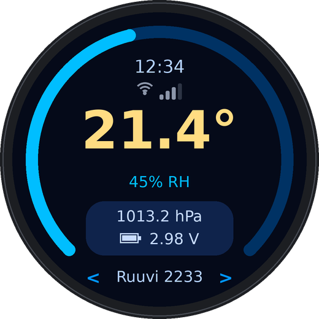
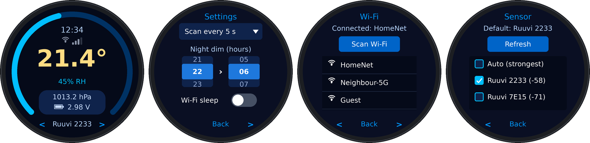

# ESP32-C3 Round RuuviTag Display Hub (GC9A01)

RuuviTag dashboard for the round **ESP32-2424S012** (ESP32-C3, 1.28" 240x240 GC9A01, CST816S touch),
built with LVGL 8. It listens to RuuviTag BLE advertisements (data format 5) and shows temperature,
humidity, pressure and battery voltage, plus an NTP clock.

<p align="center">
  
</p>

<p align="center"><em>Rendered preview of the main screen (generated from the layout in <code>gui_ruuvi.cpp</code>, not a photo of the device).</em></p>

## Screens and gestures

**Main screen**

| Gesture | Action |
|---|---|
| Swipe left / right (or tap `<` `>`) | Show the previous / next sensor |
| Swipe up / down | Brightness |
| Long press (about 0.7 s) | Open the setup screens |

**Setup screens** (Settings, Wi-Fi, Sensor): swipe left/right or tap `<` `>` to move between them,
tap **Back** to return to the main screen. They also close by themselves after 60 s without a touch.

<p align="center">
  
</p>

| Main | Settings | Wi-Fi | Sensor |
|---|---|---|---|
| Temperature, humidity gauge, pressure, battery voltage, clock, Wi-Fi strength, name of the sensor shown | Scan interval, night-dim hours, Wi-Fi sleep | Scan and connect with an on-screen keyboard | Tick box = default sensor (or Auto = strongest signal) |

The **default sensor** is the one the main screen starts on and returns to (after 60 s without a touch,
see `VIEW_REVERT_MS` in `config.h`). Swiping only changes what is shown, not the default.

> Status: revised version of the Gemini-generated original. **Not compiled or tested on hardware by the
> reviewer** - check the pins in `config.h` first, and expect to fix small compile issues.

## Features

- Temperature / humidity gauge / pressure / battery voltage, colour-coded, greys out and shows
  "No signal Nm" when the tag has not been heard for a while
- Every RuuviTag heard is kept in a small table, so flipping between sensors is instant; the name of the sensor shown ("Ruuvi 2233" = last two MAC bytes, as the tag names itself) is at the bottom, "Auto: 2233" when following the strongest tag
- Default sensor chosen with tick boxes on the Sensor page (saved to flash), or "Auto" to follow the strongest tag
- `<` `>` arrows at the bottom of the main screen step through the sensors; setup screens have `<` `Back` `>`
- Dim-grey Wi-Fi symbol with 4 signal bars under the clock on the main page (bars unlit when not connected or when Wi-Fi is sleeping)
- Touch UI: swipe left/right on the main screen to flip between sensors, long press for setup, swipe up/down = brightness
- Night dimming with configurable hours; touching the screen at night wakes it for 20 s
- On-screen Wi-Fi setup (async scan, password keyboard); credentials are saved only after a successful connection
- Optional "Wi-Fi sleep": Wi-Fi turns off after the NTP sync and wakes once a day to re-sync (less heat)
- Scan interval, night hours, brightness, Wi-Fi sleep and selected tag persist in flash (NVS)

## Hardware

ESP32-2424S012 (AliExpress: <https://www.aliexpress.com/item/1005007051709033.html>)

Pins are collected in `config.h` (backlight, touch I2C) and `User_Setup_ESP32-2424S012.h` (display).
The ESP32-C3 only has GPIO0-GPIO21 - GPIO22 does not exist on it.
The values in this repo are from memory of the board's pinout: **verify them** against your board docs or a
sketch that already works on it.

## Libraries / environment (Arduino IDE)

| Library | Version |
|---|---|
| `lvgl` | **8.3.x** (e.g. 8.3.11) - not 9.x |
| `TFT_eSPI` (Bodmer) | recent; make sure it supports your arduino-esp32 core version |
| `NimBLE-Arduino` (h2zero) | **1.4.x** - 2.x has a different scan API |

Board: `ESP32C3 Dev Module`, Flash 4MB, Partition `Minimal SPIFFS (Large APPS with OTA)`.
The backlight code works on arduino-esp32 core 2.x and 3.x.

### lv_conf.h (place next to the `lvgl` folder in `libraries/`)

```c
#define LV_COLOR_DEPTH      16
#define LV_COLOR_16_SWAP    0
#define LV_MEM_SIZE         (40U * 1024U)
#define LV_FONT_MONTSERRAT_16 1
#define LV_FONT_MONTSERRAT_48 1
// LV_TICK_CUSTOM may be 0 or 1: the sketch calls lv_tick_inc() only when it is 0.
// Widgets used: arc, label, list, keyboard, textarea, roller, dropdown, switch, tileview, btn (all default-on)
```

### TFT_eSPI

Use `User_Setup_ESP32-2424S012.h` as a template for `libraries/TFT_eSPI/User_Setup.h`.

## Files

| File | Purpose |
|---|---|
| `ESP32-C3-Round-RuuviTag.ino` | display + touch drivers for LVGL, main loop |
| `config.h` | pins, time zone, timings |
| `settings.*` | persistent settings (NVS), debounced saving |
| `ruuvi_ble.*` | BLE scan, format-5 parser, latest reading per tag, thread-safe data access |
| `wifi_manager.*` | async scan, connect, NTP, Wi-Fi sleep (no LVGL dependency) |
| `gui_ruuvi.*` | all LVGL screens, laid out for the round display |
| `backlight.*` | PWM backlight |
| `touch_cst816s.*` | minimal CST816S I2C driver |

## What changed compared to the original

**Correctness**
- Ruuvi manufacturer ID bytes were checked in the wrong order (`99 04` on the air) - packets never matched
- Uses only LVGL 8.3 API names (the original mixed in v9 names such as `lv_list_add_button`, `lv_button_create`,
  `lv_obj_delete`, `LV_SYMBOL_BATTERY`)
- Added the missing touch driver + LVGL input device, and an LVGL tick source
- Network list buttons now actually have a click handler
- `wantDuplicates = true`, so "Continuous" mode keeps updating
- Invalid sensor values (0x8000 / 0xFFFF / 0x7FF) are detected; bytes are parsed as `uint8_t`

**Robustness**
- BLE task -> UI data passed under a spinlock
- Non-blocking `getLocalTime(.., 0)` and asynchronous Wi-Fi scan (no UI freezes)
- Wi-Fi credentials saved only after a successful connection; falls back to the old network on failure
- Password dialog is a single modal, deleted with `lv_obj_del_async`
- Stale-data indicator; continuous scan restarts once a minute to flush the result list

**Usability**
- Select which RuuviTag to show; auto mode follows the strongest one
- Settings persist; rollers show the real values; night mode can be overridden by touch
- Battery shown as voltage, with a battery icon
- Widgets moved inside the visible circle (keyboard, list, text fields)
- Main screen: swipe left/right (or `<` `>`) switches sensor, long press opens the setup screens, bottom strip shows the sensor name
- Setup screens on their own screen with a Back button and an idle timeout
- Wi-Fi signal indicator under the clock
- Sensor page uses tick boxes for the default sensor; the default is listed even when it is not currently heard
